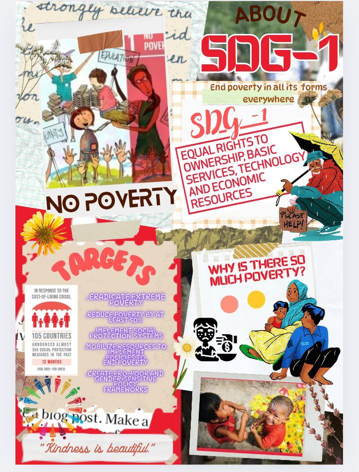

# vridhi-gautam.github.io
# 🎨 SDG Poster Using Canva AI Tools

This project showcases a digital poster designed using **Canva's AI tools** to raise awareness about the **UN Sustainable Development Goals (SDGs)**. It was created as part of a tech-for-good initiative .

## 🏆 Achievements
- Designed using **Canva AI**, layout tools, and visual storytelling principles

## 📌 Highlights

- Theme: Sustainable Development Goals (SDGs)
- Tools Used: Canva AI (Magic Design, Magic Write) 
- Format: High-resolution JPG/PNG

## 🖼️ Poster Preview

## 📂 Repository Contents

- `poster.jpg` – Final exported poster
- `README.md` – Project overview

---

## 🎯 Skills Showcased

- Canva AI Creativity
- Visual Communication
- Thematic Design Thinking
